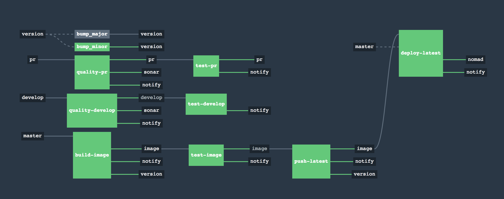

# site-index

This is a containerized [Flask](http://flask.pocoo.org/)-based server that reads service data from Consul (any service tagged as **http**) and presents a directory of service links on a single index page.  

#### Requirements 

- a DNS server that resolves the web server address for the domain configured at the **$DOMAIN** environment variable.

## Purpose

While this is actually a useful tool in my hobby lab, it also serves as my CI/CD flagship platform, leveraging the following technologies:

- Concourse
- Github
- Sonarqube
- Docker
- Consul
- Vault
- Slack
- Nomad

## The Concourse Pipeline
 

#### Development branch:

Any commits to the _***develop*** branch are scanned for code quality (Sonarqube) and unit tested.

#### Pull Requests:

Any pull requests are scanned and tested like the ***develop*** branch.

#### Master branch:

All commits to the ***master*** branch (you should really resitrict this to PR merges) are assumed to have passed quality and unit tests.  A Docker image is built and versioned as a release canidiate at both the Git repo and the Docker repositories defined in the CI Pipeline settings.  A test is run against the built Docker image.  If the tests are successful, the image version is patch-level bumped and pushed to the Docker repository with the new version tag as well as the latest tag.

#### Minor/Major versioning:

_this feature is a work in progress and may not work as intended or desired_

As the Pipeline handles all versioning via Git tags, I have provided facilities in the Pipeline for bumping the versions to Minor or Major as required.  Navigate to your Concourse GUI and click on the ***bump\_*** tasks and hit the Plus symbol to bump to the desired version. 
